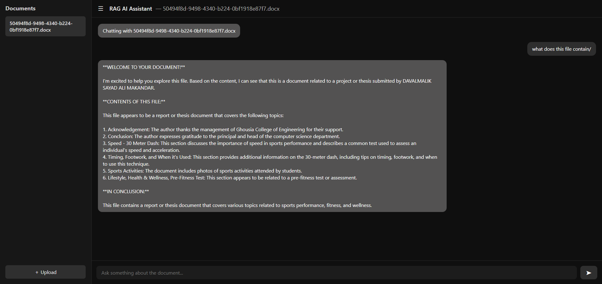
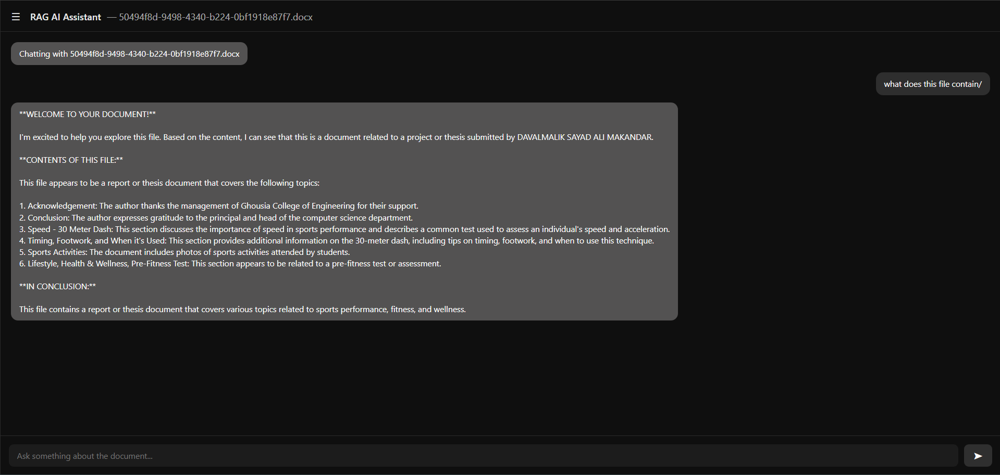

# 📄 RAG AI Assistant – Document Chat System

A **Retrieval-Augmented Generation (RAG)** based AI assistant that allows users to upload documents and chat with them through a ChatGPT-like interface.

This project combines **FastAPI**, **LangChain**, **ChromaDB**, and **Groq LLMs** to deliver accurate, document-grounded answers with persistent chat history per document.


## 🚀 Features

### ✅ Core Capabilities

* 📂 Upload documents (PDF, TXT, DOCX, etc.)
* 🧠 Automatic text extraction, chunking, and embedding
* 🔍 Semantic retrieval using vector similarity (RAG)
* 💬 Chat with **one selected document at a time**
* 🗂️ Separate chat history per document
* ♻️ Persistent storage (files, vectors, history survive restarts)

### ✅ User Experience

* professional-style interface
* Sidebar document list
* Instant document switching
* Auto-load previous chat history
* Clean scrolling chat UI
* Upload validation & error handling


## 🖼️ User Interface
### Initial ui


### 📂 Document Selection & Upload


### 💬 Chat with Document


### 📑 Sidebar Navigation



---

## 🏗️ Architecture Overview

```
┌───────────────┐
│     Frontend  │  (HTML + CSS + JS)
│  Chat UI      │
└───────┬───────┘
        │
        ▼
┌───────────────┐
│   FastAPI     │
│  API Layer    │
└───────┬───────┘
        │
        ├── File Upload
        │     └─ Text Extraction
        │     └─ Chunking
        │     └─ Embeddings
        │     └─ Vector Storage
        │
        ├── Chat Requests
        │     └─ Retriever (ChromaDB)
        │     └─ Context Builder
        │     └─ LLM (Groq)
        │
        ▼
┌───────────────┐
│  ChromaDB     │
│  Vector Store │
└───────────────┘
```


## 🧠 RAG Pipeline

1. **Upload Document**
2. **Text Extraction**
3. **Chunking**
4. **Embedding (HuggingFace)**
5. **Vector Storage (ChromaDB)**
6. **Query Embedding**
7. **Semantic Retrieval**
8. **Context Injection**
9. **LLM Answer Generation**

The LLM is strictly instructed to answer **only from retrieved context**.


## 🛠️ Tech Stack

### Backend

* **FastAPI**
* **LangChain**
* **ChromaDB**
* **Groq LLM**
* **Pydantic**

### AI / ML

* `sentence-transformers/all-MiniLM-L6-v2`
* Retrieval-Augmented Generation (RAG)

### Frontend

* HTML
* CSS
* Vanilla JavaScript


## 📁 Project Structure

```
rag-ai-assistant/
│
├── app.py                 # FastAPI application
├── vectordb.py            # Ingestion, chunking, embeddings, storage
├── retriever.py           # Semantic search logic
├── llm_engine.py          # RAG prompt + LLM invocation
├── text_extractor.py      # File text extraction
│
├── uploads/               # Uploaded documents
├── history/               # Per-documentallon chat history
├── chromadb_db/           # Vector database
│
├── templates/
│   └── index.html         # UI
│
├── static/
│   └── style.css          # UI styling
│
├── requirements.txt
└── README.md
```


## ⚙️ Installation & Setup

### 1️⃣ Clone the Repository

```bash
git clone https://github.com/yourusername/rag-ai-assistant.git
cd rag-ai-assistant
```

### 2️⃣ Create Virtual Environment

```bash
python -m venv .venv
source .venv/bin/activate   # Windows: .venv\Scripts\activate
```

### 3️⃣ Install Dependencies

```bash
pip install -r requirements.txt
```

### 4️⃣ Environment Variables

Create a `.env` file:

```env
GROQ_API_KEY=your_groq_api_key
GROQ_MODEL=llama-3.1-8b-instant
```

---

## ▶️ Run the Application

```bash
uvicorn app:app --reload
```

Open in browser:

```
http://127.0.0.1:8000
```


## 💬 How to Use

1. Upload a document using the **+ Upload** button
2. Select the document from the sidebar
3. Ask questions related to that document
4. Switch documents to start a new contextual chat
5. Chat history is automatically preserved per document


## 🔐 Design Decisions

* **Single-file context** (no multi-file mixing)
  → Improves answer accuracy and UX clarity

* **File-scoped chat history**
  → Prevents cross-document contamination

* **No session IDs**
  → Simple, filename-based persistence (ideal for local apps)

* **Strict RAG prompt**
  → Prevents hallucinations


## ⚠️ Known Limitations

* Only **one document at a time**
* No streaming responses (yet)
* No authentication
* No document deletion UI
* Designed for local / demo use (not production-scale)


## 🔮 Future Improvements

* 🔄 Streaming (token-by-token) responses
* 📑 Source citations per answer
* 🧠 Improved multi-file reasoning
* 🧾 Markdown rendering
* 🗑️ Document deletion
* 🌐 React frontend
* 🔐 User authentication


## 📌 Status

**✔ Functional
✔ Stable
✔ Clean UX
✔ Resume-ready project**


## 👨‍💻 Author

**Dawal Malik**
AI / ML Developer
Focused on RAG systems, LLMs, and applied AI engineering

